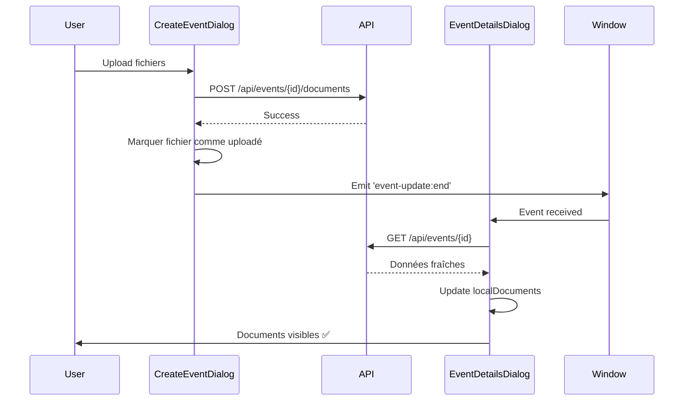

# Fix: Actualisation Dynamique des Documents dans EventDetailsDialog

## Problème Identifié

Après upload de fichiers via `CreateEventDialog.tsx`, la liste des documents dans `EventDetailsDialog.tsx` n'était pas mise à jour dynamiquement. Il fallait recharger la page pour voir les nouveaux documents.

## Cause Racine

L'`EventDetailsDialog.tsx` écoute l'événement `event-update:end` pour actualiser ses données :

```tsx
const onEnd = (e: any) => {
  try {
    const id = e?.detail?.eventId;
    if (!id || id !== event.id) return;
    refetchEvent(); // Recharge tous les détails de l'événement
  } catch {}
};
window.addEventListener('event-update:end', onEnd as any);
```

Mais les fonctions d'upload dans `CreateEventDialog.tsx` et `EventWizardCore.tsx` n'émettaient pas cet événement après avoir uploadé les fichiers.

## Solution Implémentée

### CreateEventDialog.tsx

Ajout de l'émission d'événement après les uploads :

```tsx
// Dans uploadFilesToEvent()
for (const fileObj of filesToUpload) {
  // ... upload logic ...
}

// ✅ NOUVEAU : Émettre un événement pour notifier la mise à jour
try {
  window.dispatchEvent(
    new CustomEvent('event-update:end', { detail: { eventId } })
  );
  console.log(`📄 Documents mis à jour pour événement ${eventId}`);
} catch (error) {
  console.error('❌ Erreur émission événement:', error);
}
```

### EventWizardCore.tsx

Même logique pour les presets :

```tsx
// Dans uploadFilesToEventWizard()
for (const fileObj of filesToUpload) {
  // ... upload logic ...
}

// ✅ NOUVEAU : Émettre un événement pour notifier la mise à jour
try {
  window.dispatchEvent(
    new CustomEvent('event-update:end', { detail: { eventId: presetId } })
  );
  console.log(`📄 Documents mis à jour pour preset ${presetId}`);
} catch (error) {
  console.error('❌ Erreur émission événement preset:', error);
}
```

## Flux de Communication



## Avantages

1. **✅ Actualisation Temps Réel** : Les documents apparaissent immédiatement après upload
2. **✅ Cohérence UI** : Plus besoin de recharger la page
3. **✅ Extensibilité** : Le pattern peut être réutilisé pour d'autres mises à jour
4. **✅ Logs Clairs** : Messages explicites pour debug (`📄 Documents mis à jour`)

## Tests

### Scénario 1 : CreateEventDialog → EventDetailsDialog
1. Ajouter un événement via `CreateEventDialog` avec fichiers
2. Ouvrir `EventDetailsDialog` pour cet événement
3. ✅ Vérifier que les documents sont visibles immédiatement

### Scénario 2 : Upload pendant EventDetailsDialog ouvert
1. Ouvrir `EventDetailsDialog` pour un événement
2. Dans un autre onglet, ajouter des fichiers à cet événement
3. ✅ Vérifier que les documents apparaissent dans `EventDetailsDialog`

## Log Pattern

Les uploads émettent maintenant des logs identifiables :

```
✅ Fichier uploadé: document.pdf
📄 Documents mis à jour pour événement 123
```

## Statut

- ✅ **CreateEventDialog.tsx** : Émission d'événement après upload
- ✅ **EventWizardCore.tsx** : Émission d'événement après upload preset
- ✅ **EventDetailsDialog.tsx** : Écoute déjà 'event-update:end'
- ✅ **Compilation** : Aucune erreur TypeScript

La solution est complète et prête pour les tests utilisateur.
