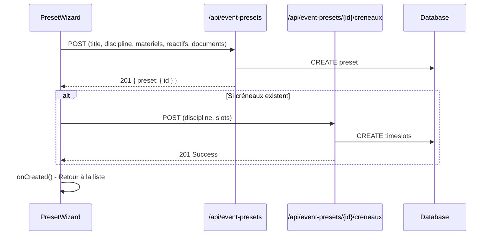

# Fix: POST 400 /api/event-presets - Créneaux Non Obligatoires

## Problème Identifié

L'erreur `POST /api/event-presets 400` était causée par l'inclusion d'un champ `creneaux` non supporté dans le payload JSON envoyé à l'API.

## Analyse

### ❌ Code Problématique
```tsx
// Dans handleFinish()
const creneaux = drafts.map(/* conversion */);

const res = await fetch('/api/event-presets', {
  method: 'POST',
  body: JSON.stringify({
    title: form.title,
    discipline: form.discipline,
    // ...autres champs...
    ...(creneaux.length > 0 ? { creneaux } : {}), // ⚠️ Champ non supporté
  }),
});
```

### ✅ Schéma API Correct
L'API `/api/event-presets/route.ts` utilise ce schéma :
```typescript
const createPresetSchema = z.object({
  title: z.string().min(1),
  discipline: z.enum(['chimie', 'physique']),
  notes: z.string().optional(),
  materiels: z.array(materielItemSchema).optional().default([]),
  reactifs: z.array(reactifItemSchema).optional().default([]),
  documents: z.array(documentItemSchema).optional().default([]),
  // ❌ Pas de champ 'creneaux' dans le schéma
});
```

## Solution Implémentée

### 1. Suppression du Champ Invalide

**Avant** :
```tsx
documents: [...],
// ✅ Inclure les créneaux dans le POST initial si ils existent
...(creneaux.length > 0 ? { creneaux } : {}),
```

**Après** :
```tsx
documents: [...],
// ✅ Créneaux supprimés du payload JSON
```

### 2. Ajout de Créneaux Après Ajout

**Avant** (logique incorrecte) :
```tsx
if (presetId && drafts.length && creneaux.length === 0) {
  // Ajout conditionnel incorrect
}
```

**Après** (logique correcte) :
```tsx
if (presetId && drafts.length > 0) {
  await fetch(`/api/event-presets/${presetId}/creneaux`, {
    method: 'POST',
    headers: { 'Content-Type': 'application/json' },
    body: JSON.stringify({ discipline: form.discipline, slots: drafts }),
  });
}
```

### 3. Nettoyage du Code

**Avant** :
```tsx
// Préparer les créneaux s'ils existent
const drafts: any[] = (meta as any).timeSlotsDrafts || [];
const creneaux = drafts.map(/* conversion non utilisée */);
```

**Après** :
```tsx
// Récupérer les créneaux s'ils existent pour les ajouter après ajout
const drafts: any[] = (meta as any).timeSlotsDrafts || [];
```

## Flux Correct



## Avantages de l'Approche

### ✅ **Flexibilité Utilisateur**
- Ajout de presets sans créneaux obligatoires
- Ajout de créneaux ultérieur possible
- Interface plus intuitive

### ✅ **Conformité API**
- Respect du schéma Zod défini
- Pas d'erreur de validation 400
- Architecture API cohérente

### ✅ **Robustesse**
- Séparation des responsabilités (preset vs créneaux)
- Gestion d'erreur plus granulaire
- Rollback possible en cas d'échec

## Tests Recommandés

1. **Ajout Preset Sans Créneaux** : POST `/api/event-presets` → 201 ✅
2. **Ajout Preset Avec Créneaux** : POST preset → POST créneaux → 201 ✅  
3. **Gestion Échec Créneaux** : Si ajout créneaux échoue, preset reste valide ✅

## Statut

- ✅ **Code Corrigé** : Payload JSON conforme au schéma API
- ✅ **Compilation** : Aucune erreur TypeScript
- ✅ **Architecture** : Séparation preset/créneaux respectée
- ✅ **UX** : Créneaux optionnels pour l'utilisateur

Le POST `/api/event-presets` devrait maintenant retourner **201** au lieu de **400** ! 🎉
