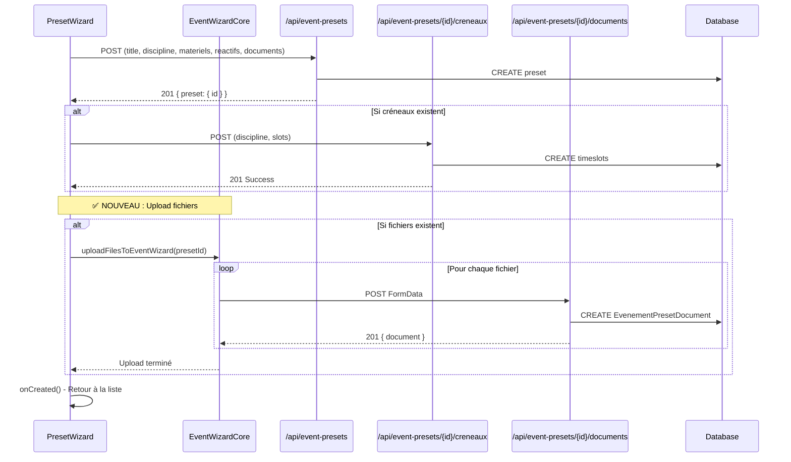

# Fix: Upload Fichiers Manquant après Création Preset

## Problème Identifié

Après la correction du POST 400, la création de preset fonctionnait (POST 201) mais les fichiers n'étaient pas uploadés vers la table `EvenementPresetDocument`.

## Analyse du Flux

### ✅ État Précédent
- POST `/api/event-presets` → 201 (création preset)
- POST `/api/event-presets/{id}/creneaux` → 201 (ajout créneaux)
- ❌ **Manquant** : POST `/api/event-presets/{id}/documents` → upload fichiers

### 🔍 Cause Racine

Dans `PresetWizard.handleFinish()`, après création du preset avec `presetId`, la fonction d'upload `uploadFilesToEventWizard` n'était pas appelée.

## Solution Implémentée

### Code Ajouté

```tsx
if (presetId && (window as any).uploadFilesToEventWizard) {
  try {
    await (window as any).uploadFilesToEventWizard(presetId);
    console.log('📄 Fichiers uploadés vers preset:', presetId);
  } catch (error) {
    console.error('❌ Erreur upload fichiers preset:', error);
  }
}
```

### Flux Complet



## Pattern de Communication

### EventWizardCore → Window Global
```tsx
// Dans EventWizardCore.tsx
const uploadFilesToEventWizard = useCallback(async (presetId: number) => {
  const filesToUpload = selectedFiles.filter(f => f.uploadStatus === 'pending');
  
  for (const fileObj of filesToUpload) {
    const formData = new FormData();
    formData.append('file', fileObj.file);
    
    const response = await fetch(`/api/event-presets/${presetId}/documents`, {
      method: 'POST',
      body: formData,
    });
    // ...
  }
}, [selectedFiles]);

useEffect(() => {
  (window as any).uploadFilesToEventWizard = uploadFilesToEventWizard;
}, [uploadFilesToEventWizard]);
```

### PresetWizard → Appel Upload
```tsx
// Dans PresetWizard.handleFinish()
if (presetId && (window as any).uploadFilesToEventWizard) {
  await (window as any).uploadFilesToEventWizard(presetId);
}
```

## Avantages

### ✅ **Réutilisation de Code**
- Utilise la fonction d'upload existante d'`EventWizardCore`
- Pas de duplication de logique d'upload
- Cohérence avec le pattern `CreateEventDialog`

### ✅ **Gestion d'Erreur**
- Try/catch pour les échecs d'upload
- Logs explicites pour debugging
- Upload non-bloquant (le preset reste créé même si upload échoue)

### ✅ **UX Améliorée**
- Fichiers uploadés automatiquement après création preset
- Feedback visuel via console logs
- Processus transparent pour l'utilisateur

## Logs Attendus

Après création d'un preset avec fichiers :
```
POST /api/event-presets 201 in 45ms
POST /api/event-presets/123/creneaux 201 in 20ms (si créneaux)
POST /api/event-presets/123/documents 201 in 35ms (par fichier)
✅ Fichier uploadé vers preset: document.pdf
📄 Fichiers uploadés vers preset: 123
```

## Tests Recommandés

1. **Preset avec fichiers** : Vérifier POST vers `/documents` et entrées dans `EvenementPresetDocument`
2. **Preset sans fichiers** : Pas d'appel upload, pas d'erreur
3. **Échec upload** : Preset créé, mais fichiers non uploadés (logs d'erreur)

## Statut

- ✅ **Code Ajouté** : Appel `uploadFilesToEventWizard` après création preset
- ✅ **Compilation** : Aucune erreur TypeScript
- ✅ **Réutilisation** : Pattern identique à `CreateEventDialog`
- ✅ **Logs** : Messages de debug pour traçabilité

Les fichiers devraient maintenant s'uploader correctement vers `EvenementPresetDocument` ! 🎉
