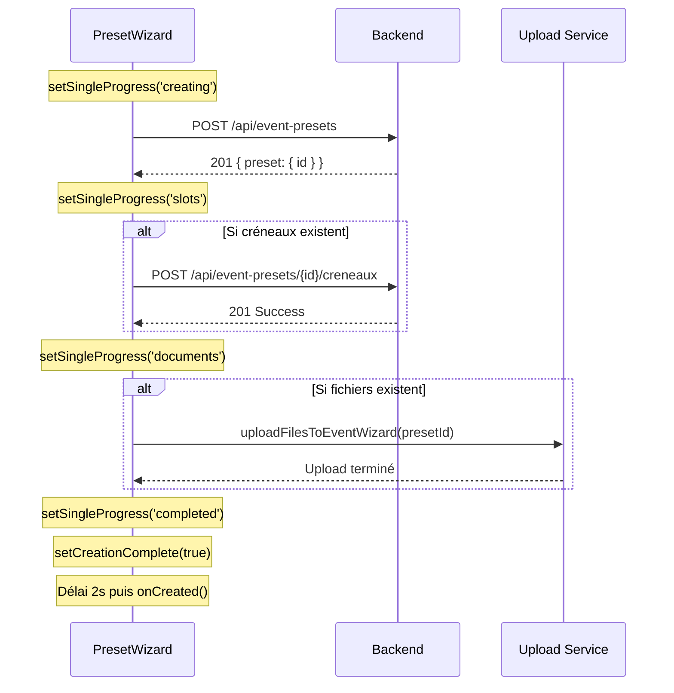

# Feature: Timeline pour Création TP Individuel

## Implémentation Ajoutée

### 🎯 **Objectif**
Ajouter une timeline de progression pour la création d'un TP individuel, similaire à celle du batch, et éviter le changement de tab immédiat pour permettre à l'utilisateur de vérifier la validation.

### ✨ **Nouvelles Fonctionnalités**

#### 1. **État de Progression Individuel**
```tsx
const [singleProgress, setSingleProgress] = useState<{
  title: string;
  status: 'pending' | 'creating' | 'slots' | 'documents' | 'completed' | 'error';
  documentCount: number;
  slotsCount: number;
  error?: string;
} | null>(null);

const [creationComplete, setCreationComplete] = useState(false);
```

#### 2. **Timeline Visuelle**
- **Indicateur Principal** : Cercle coloré avec animation pulse
- **Statut TP** : Cercle vert ✅ / gris ⚫
- **Statut Créneaux** : Cercle vert/orange selon nombre / gris si aucun
- **Statut Documents** : Cercle vert/orange selon nombre / gris si aucun
- **Spinner** : Indicateur d'activité pendant chaque phase

#### 3. **Phases de Création Trackées**
1. **'creating'** : POST `/api/event-presets` → Création TP
2. **'slots'** : POST `/api/event-presets/{id}/creneaux` → Ajout créneaux
3. **'documents'** : Upload fichiers via `uploadFilesToEventWizard`
4. **'completed'** : Toutes les étapes terminées

### 🔄 **Flux de Progression**



### 🎨 **Interface Utilisateur**

#### **Timeline de Progression**
```tsx
{singleProgress && (
  <Box sx={{ mt: 3, width: '100%', maxWidth: 600, mx: 'auto' }}>
    <Typography variant="body2" gutterBottom sx={{ fontWeight: 'bold' }}>
      Ajout en cours...
    </Typography>
    
    <Typography variant="caption" color="text.secondary">
      • TP • Créneaux • Documents
    </Typography>
    
    <Card sx={{ p: 2 }}>
      <Box display="flex" alignItems="center" gap={2}>
        {/* Indicateur principal avec animation pulse */}
        <Box sx={{ 
          width: 12, height: 12, borderRadius: '50%',
          bgcolor: status === 'completed' ? 'success.main' : 'primary.main',
          animation: 'pulse 1.5s ease-in-out infinite'
        }} />
        
        <Typography>{singleProgress.title}</Typography>
        
        {/* 3 indicateurs de statut */}
        <Tooltip title="TP ajouté">
          <Box sx={{ width: 8, height: 8, bgcolor: 'success.main' }} />
        </Tooltip>
        <Tooltip title="X créneau(x) ajouté(s)">
          <Box sx={{ width: 8, height: 8, bgcolor: 'success.main' }} />
        </Tooltip>
        <Tooltip title="X document(s) ajouté(s)">
          <Box sx={{ width: 8, height: 8, bgcolor: 'success.main' }} />
        </Tooltip>
        
        {/* Spinner pendant traitement */}
        {status === 'creating' && <CircularProgress size={16} />}
      </Box>
    </Card>
  </Box>
)}
```

#### **Écran de Completion**
```tsx
{creationComplete && (
  <Box sx={{ mt: 2, textAlign: 'center' }}>
    <Typography variant="body2" color="success.main" sx={{ fontWeight: 'bold', mb: 2 }}>
      ✅ TP créé avec succès !
    </Typography>
    
    <Button variant="contained" color="success" startIcon={<CheckIcon />}>
      Terminer maintenant
    </Button>
    
    <Typography variant="caption" color="text.secondary">
      ou retour automatique dans quelques secondes...
    </Typography>
  </Box>
)}
```

### ⏱️ **Gestion du Délai**

#### **Avant** : Retour immédiat au tab 0
```tsx
// Ancien comportement
onCreated(); // ⚡ Changement immédiat
```

#### **Après** : Délai pour visualisation
```tsx
// Nouveau comportement
setCreationComplete(true);

// Délai automatique de 2 secondes
setTimeout(() => {
  onCreated();
}, 2000);

// OU bouton manuel pour terminer immédiatement
<Button onClick={() => onCreated()}>Terminer maintenant</Button>
```

### 🛡️ **Gestion d'Erreurs**

#### **Catch d'Erreurs**
```tsx
catch (error) {
  console.error(error);
  const errorMessage = error instanceof Error ? error.message : 'Erreur inconnue';
  setSingleProgress(prev => 
    prev ? { ...prev, status: 'error', error: errorMessage } : null
  );
}
```

#### **Affichage d'Erreur**
```tsx
{singleProgress.error && (
  <Typography variant="caption" color="error">
    {singleProgress.error}
  </Typography>
)}
```

### 📊 **Avantages UX**

#### ✅ **Visibilité du Processus**
- L'utilisateur voit chaque étape de création
- Animation et feedback visuel en temps réel
- Indicateurs spécifiques pour TP/créneaux/documents

#### ✅ **Contrôle de Rythme**
- Délai de 2 secondes pour apprécier le succès
- Bouton "Terminer maintenant" pour les utilisateurs impatients
- Pas de changement de tab brutal et imprévu

#### ✅ **Feedback d'État**
- Tooltips explicites sur chaque phase
- Messages d'erreur clairs si échec
- Cohérence avec l'interface batch existante

#### ✅ **Pattern Réutilisable**
- Structure similaire au `BatchPresetWizard`
- Components Material-UI standards
- Logique d'état React propre

### 🔧 **Configuration**

#### **States Ajoutés**
- `singleProgress`: Tracking de la progression complète
- `creationComplete`: Flag pour l'écran de fin
- Délai configurable dans `setTimeout()`

#### **Phases Trackées**
- **creating**: Création TP principal
- **slots**: Ajout des créneaux (si existants)
- **documents**: Upload des fichiers (si existants)
- **completed**: Tout terminé avec succès

#### **Integration Points**
- Utilise `uploadFilesToEventWizard` existant
- Compatible avec `EventWizardCore`
- S'intègre dans le flux `handleCreated` → `tab 0`

Cette implémentation offre une expérience utilisateur cohérente et informative pour la création de TP individuels ! 🎉
